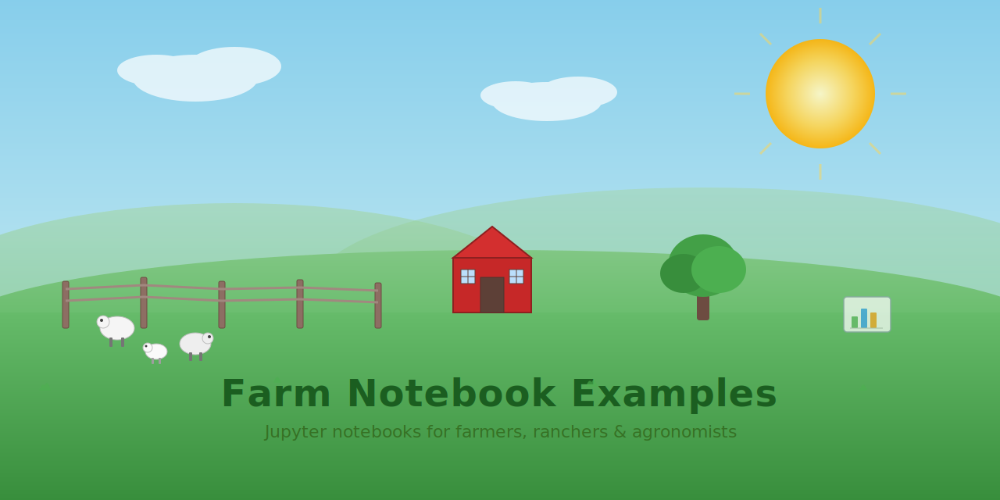
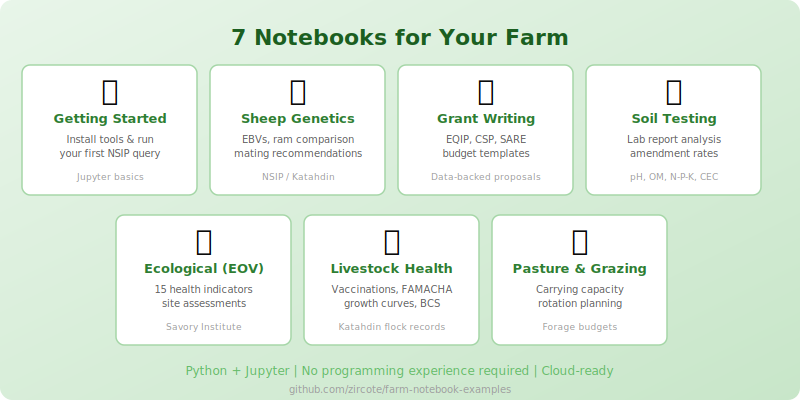

# Farm Notebook Examples

[](LICENSE)
[](https://www.python.org/downloads/)
[](https://jupyter.org/)
[](https://github.com/zircote/nsip)

Beginner-friendly [Jupyter notebooks](https://jupyter.org/) (interactive documents that mix text, code, and charts) for farmers, ranchers, and agronomists. Whether you're tracking soil health, managing livestock genetics, writing grant applications, or planning grazing rotations, these notebooks provide practical, hands-on tools you can adapt to your operation.

<picture>
  <source media="(prefers-color-scheme: dark)" srcset=".github/social-preview-dark.svg">
  <source media="(prefers-color-scheme: light)" srcset=".github/social-preview.svg">
  
</picture>

## Who Is This For?

- **Farmers and ranchers** looking to use data for better decisions
- **Agronomists** wanting reproducible analysis templates
- **Grant writers** building data-backed proposals for EQIP, CSP, SARE, and other programs
- **Katahdin sheep breeders** working with NSIP (National Sheep Improvement Program) genetic data

## Notebooks

<p align="center">
  
</p>

| Notebook | Description |
|---|---|
| [Getting Started](notebooks/getting-started.ipynb) | Installing tools, Jupyter basics, first NSIP query |
| [NSIP Sheep Genetics](notebooks/nsip-sheep-genetics.ipynb) | EBVs (Estimated Breeding Values), ram comparison, mating recommendations |
| [Grant Writing for Farms](notebooks/grant-writing-for-farms.ipynb) | EQIP/CSP/SARE proposals with budget templates |
| [Soil Testing Guide](notebooks/soil-testing-guide.ipynb) | Lab report interpretation, amendment calculations |
| [Ecological Monitoring (EOV)](notebooks/ecological-monitoring-eov.ipynb) | Savory Institute indicators, site assessments |
| [Livestock Health Records](notebooks/livestock-health-records.ipynb) | Vaccinations, FAMACHA, growth curves |
| [Pasture and Grazing Management](notebooks/pasture-grazing-management.ipynb) | Carrying capacity, rotation planning, forage budgets |

## Prerequisites

- Python 3.12+
- [git](https://git-scm.com/downloads)
- [uv](https://docs.astral.sh/uv/) package manager
- [just](https://github.com/casey/just) task runner
- [NSIP CLI](https://github.com/zircote/nsip) (for genetics notebooks)

## Quick Start

The recommended path uses `just`, which runs all setup steps (including the NSIP CLI (command-line interface) install) in one command:

```bash
# Clone the repository
git clone https://github.com/zircote/farm-notebook-examples.git
cd farm-notebook-examples

# Full setup: install all dependencies + NSIP CLI
just setup

# Start Jupyter
just lab
```

Or, if you prefer manual steps without `just`:

```bash
# Install dependencies (includes pandas, numpy, matplotlib, tabulate)
uv sync --extra data

# Start Jupyter
uv run jupyter lab
```

Open `notebooks/getting-started.ipynb` to begin.

> **Don't want to install anything?** You can run the notebooks in the cloud with Google Colab or GitHub Codespaces. See [INSTALL.md](INSTALL.md#cloud-alternatives-no-install-required) for details.

## Getting Help with Installation

- **[INSTALL.md](INSTALL.md)** -- Quick setup, cloud alternatives, and all available `just` commands
- **[SETUP.md](SETUP.md)** -- Detailed step-by-step instructions for every tool, including Windows walkthroughs

## For Contributors

### Development

Linting and formatting require the dev extras:

```bash
just install          # Installs data + dev extras (includes nbqa and ruff)

# Run CI checks (validate + lint; no NSIP CLI required)
just ci

# Lint notebooks
just lint

# Auto-fix issues
just fix
```

## License

MIT - see [LICENSE](LICENSE) for details.
